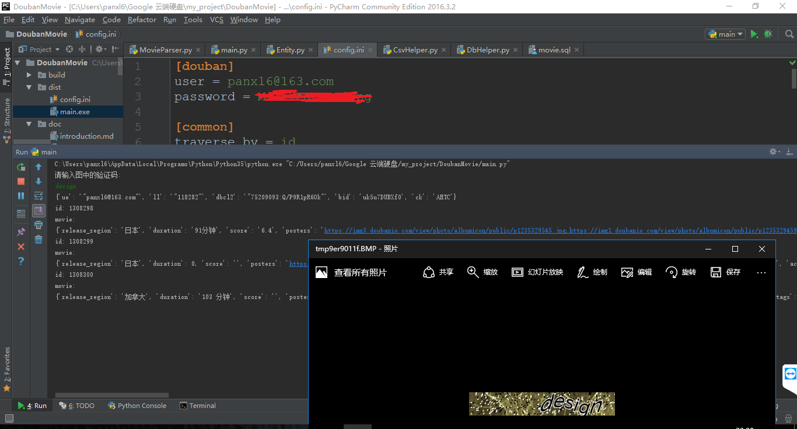

# 豆瓣电影爬虫

　　豆瓣电影数据库是目前高质量电影信息的聚集地。对于一些视频聚合应用、数据挖掘应用等场景，豆瓣电影数据库仍然是一个很好的选择。如果你只需要小规模的数据集请使用八爪鱼或者火车头之类的抓取工具。

　　本着不重复造轮子的理念，我调研了github上关于豆瓣的电影信息的爬虫程序。找到了一个star比较多（唯一一个50star以上）的一个项目[doubanspiders](https://github.com/dontcontactme/doubanspiders)

该项目存在一些问题：
- 没有实现模拟登陆，被豆瓣的反爬虫机制阻止。无法继续抓取
- 使用的相关库在windows下安装困难，但没有相关的文档
- 可定制性较差。不支持选定抓取字段
- 抓取效率较低
- 不支持后台运行

本文在关注以上问题的基础上重新设计豆瓣爬虫程序。

## 遍历方式介绍
本文涉及的遍历思路有两种：
- 根据id进行遍历
- 根据关键词种子，遍历搜索结果

### **根据id进行遍历**
豆瓣电影信息的url格式为：https://movie.douban.com/subject/id。例如：https://movie.douban.com/subject/26683290/

豆瓣是从2005年创办的，2005年以前的电影信息id很可能是最早的id。

搜索1999，得到一个1998年的电影。https://movie.douban.com/subject/1303954/。 id编号是七位的数字：1303954。搜索2016，得到最新的电影。https://movie.douban.com/subject/26928204/。 id编号是八位的数字：26928204。
由此猜测，目前(2016年)豆瓣电影的id大致是1300000到27000000。

由于反爬虫的设计，id是不连续的。为了提高命中率，需要对id的分布规律进行分析。

### **根据关键词种子，遍历搜索结果**
豆瓣电影提供了搜索接口。通过关键词搜索得到相关记录的链接。
比如按年份获取，关键词可为：2005,2006，....2016。
比如分分类获取，关键词可为：动作，冒险，爱情，记录...。

### **总结**

需要较为完整的数据库信息，可采用id遍历。
抓取的目的性较强时，可以采用关键词抓取。

# TODO:
- [ ] 豆瓣的URL设计是比较符合RESTful规范的。根据豆瓣的id即可抓取其他相关的资源
- [ ] 由于豆瓣的反爬虫机制，id是稀疏。可以考虑筛选一些没有内容的id以提高命中率。
- [ ] 由于豆瓣限制了每个IP允许抓取的访问次数，可以使用代理IP[proxymesh](https://proxymesh.com/)来提升抓取速度
- [x] 更新包依赖

影评：https://movie.douban.com/subject/26366465/reviews

图片：https://movie.douban.com/subject/26366465/all_photos

预告片：https://movie.douban.com/subject/26366465/trailer

# 使用说明
默认设置
- 测试用的账号密码
- 默认为csv方式存储，存储路径为程序当前路径
- 默认遍历方式为id遍历
- 安装依赖：`pip3 install -r requirements.txt`

# 数据库设计
很明显，项目中的数据库设计是不符合数据库范式的。为了上手容易，一切从简。

# 法律义务
该爬虫仅为个人研究。如有商业用途请与豆瓣联系或参考相关法律约束。
